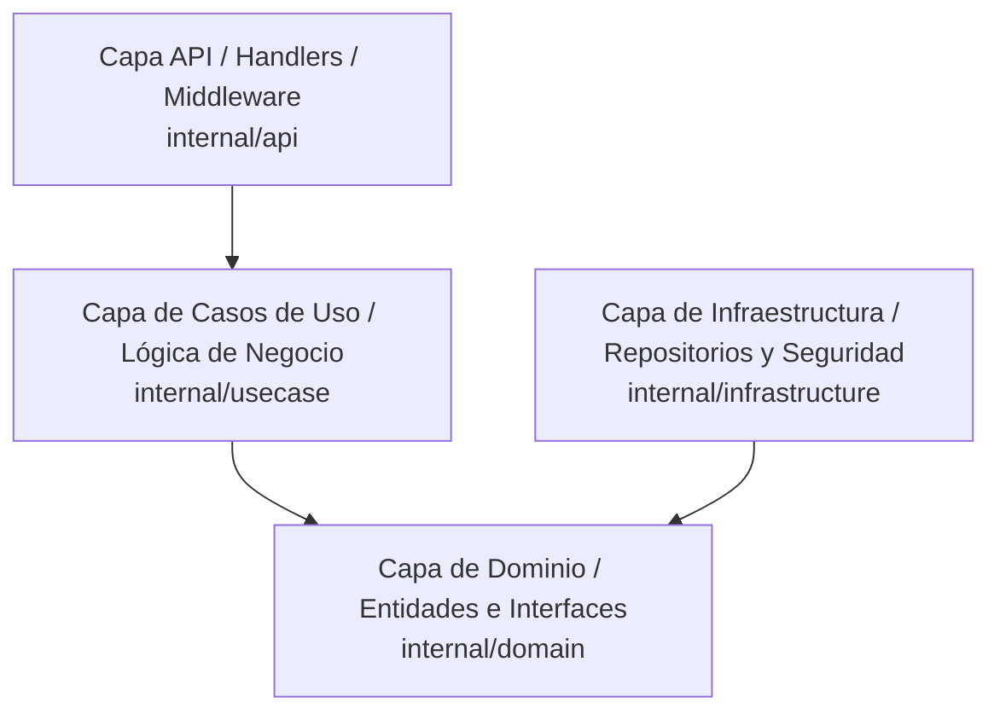

# Sakoo Backend - Contexto del Proyecto (Maestro del Agente)

Este archivo central es la **puerta de entrada** de contexto operativo para cualquier agente de Inteligencia Artificial que colabore en el desarrollo de este backend. Su propósito es guiarte rápidamente por el proyecto y enlazar con las pautas y reglas organizadas.

> [!IMPORTANT]
> **REPOMIX - LECTURA PRIMARIA OBLIGATORIA**: Existe un archivo consolidado generado por Repomix en la raíz del proyecto llamado `repomix-output.xml` (o en su defecto `repomix-output.txt`).
> Como primera acción antes de proponer cambios, analizar el código o realizar búsquedas, **debes leer e inspeccionar primero este archivo**. Esto te proporcionará la versión más actualizada, unificada y exacta de toda la base de código del repositorio en un solo paso, previniendo alucinaciones y búsquedas fragmentadas ineficientes.

---

## 📂 Organización de Instrucciones del Agente

Para mantener un orden riguroso y escalable, las reglas y pautas de desarrollo han sido segmentadas en subcarpetas físicas dentro del directorio `.agent/`:

* **Reglas de Diseño y Negocio**: Contiene las pautas inquebrantables del backend (IDs secuenciales, privacidad de errores en la API, políticas CORS para Swagger y Flutter).
  👉 Ver [architecture.md](file:///C:/Users/aaron/OneDrive/Desktop/frelanceer/sakoo/.agent/rules/architecture.md)
* **Skills Técnicos y Lenguaje**: Contiene pautas operativas del lenguaje Go (enrutamiento de Go 1.22+, gestión con pgx/v5, control de pánicos en goroutines, limpieza de compilador).
  👉 Ver [golang.md](file:///C:/Users/aaron/OneDrive/Desktop/frelanceer/sakoo/.agent/skills/golang.md)

---

## 1. Información General del Proyecto
* **Nombre del Proyecto**: Sakoo Backend
* **Lenguaje**: Go (Golang) versión 1.22+
* **Arquitectura**: **Clean Architecture** (Arquitectura Limpia)
* **Base de Datos**: PostgreSQL (puerto local `5432`, base de datos `sakoo`, usuario `postgres`)
* **Puerto del Servidor**: `:8080` (definible vía variable de entorno `PORT`)

---

## 2. Capas del Proyecto y Estructura de Directorios

El código se organiza estrictamente en cuatro capas desacopladas:

### Mapa de Archivos Core:
* [cmd/api/main.go](file:///C:/Users/aaron/OneDrive/Desktop/frelanceer/sakoo/cmd/api/main.go): Punto de entrada. Carga variables de entorno, conecta PostgreSQL, corre migraciones y levanta el servidor HTTP.
* [internal/domain/user.go](file:///C:/Users/aaron/OneDrive/Desktop/frelanceer/sakoo/internal/domain/user.go): DTOs, Entidad `User` e interfaces para repositorios y casos de uso del módulo de autenticación.
* [internal/usecase/auth_usecase.go](file:///C:/Users/aaron/OneDrive/Desktop/frelanceer/sakoo/internal/usecase/auth_usecase.go): Implementa el registro y login. Realiza hashing con `bcrypt` y firma tokens `JWT`.
* [internal/infrastructure/repository/user.go](file:///C:/Users/aaron/OneDrive/Desktop/frelanceer/sakoo/internal/infrastructure/repository/user.go): Persistencia del usuario en PostgreSQL usando `pgx/v5`.
* [internal/api/middleware/cors.go](file:///C:/Users/aaron/OneDrive/Desktop/frelanceer/sakoo/internal/api/middleware/cors.go): Motor inteligente de CORS compatible con navegadores, Swagger y clientes híbridos (Flutter).

---

## 3. Implementaciones Críticas

### A. Cifrado de Tránsito con Fallback Inteligente (RSA + PlainText)
* Las contraseñas viajan desde el frontend encriptadas con la clave pública RSA-2048 en formato Base64.
* **Smart Fallback**: Si la longitud de la contraseña recibida es **menor a 300 caracteres**, el sistema asume que es texto plano y omite el descifrado RSA. Esto permite realizar pruebas manuales sumamente rápidas en clientes REST como **Bruno/Postman** sin romper la obligación criptográfica en producción.

### B. Swagger y CORS Dinámicos (Zero-Config Tunneling)
* **Swagger Autodetectable**: El host de Swagger UI no depende de variables estáticas. Se resuelve dinámicamente extrayendo las cabeceras `X-Forwarded-Host` y `X-Forwarded-Proto` (ideales para Cloudflared Tunnels).
* **Motor CORS Híbrido**: Refleja el origen de confianza con `Credentials: true` para habilitar peticiones autenticadas de Swagger y Flutter Web, mientras que permite el paso sin restricciones de clientes móviles (sin header `Origin`).

---

## 4. Comandos Útiles para el Agente
* **Compilar el Servidor Core**: `go build ./cmd/api`
* **Ejecutar el Servidor**: `go run ./cmd/api`
* **Ejecutar Suite de Integración Completa**: `go run scratch/test_trace_logs.go`
