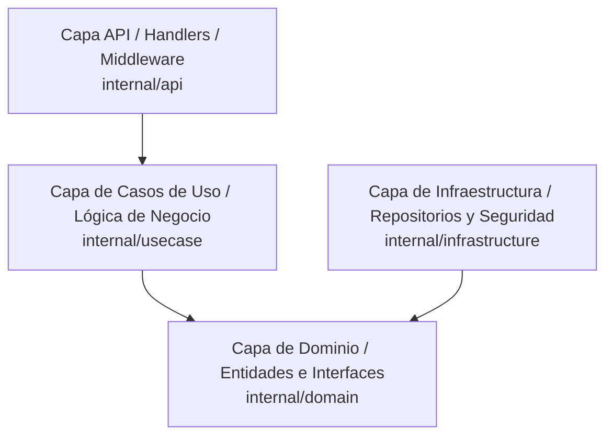

# Sakoo Backend - Contexto del Proyecto y Arquitectura (Guía del Agente)

Este documento sirve como la **fuente de la verdad del contexto operativo** para cualquier agente de Inteligencia Artificial que colabore en el desarrollo de este backend. Su propósito es evitar alucinaciones, asegurar la coherencia arquitectónica y proporcionar un arranque rápido sobre las decisiones de diseño tomadas.

---

## 1. Información General del Proyecto
* **Nombre del Proyecto**: Sakoo Backend
* **Lenguaje**: Go (Golang) versión 1.22+
* **Arquitectura**: **Clean Architecture** (Arquitectura Limpia)
* **Base de Datos**: PostgreSQL (puerto local `5432`, base de datos `sakoo`, usuario `postgres`)
* **Puerto del Servidor**: `:8080` (definible vía variable de entorno `PORT`)

---

## 2. Reglas Arquitectónicas Críticas (Inamovibles)

> [!IMPORTANT]
> **Identificadores Secuenciales (NO UUIDs)**: Todos los identificadores (IDs) en el sistema (usuarios, logs, etc.) deben ser estrictamente numéricos enteros secuenciales (`BIGSERIAL` en la base de datos PostgreSQL, `int64` en Go). **Bajo ninguna circunstancia se deben usar UUIDs.**

> [!WARNING]
> **Privacidad de Detalles Técnicos**: Ningún error nativo de base de datos SQL o del pool de conexiones (como restricciones de unicidad o fallos del driver) debe ser expuesto directamente en el JSON de respuesta al cliente HTTP. Todos los errores deben ser interceptados en la capa API/Handlers y traducidos a mensajes y códigos amigables.

---

## 3. Capas del Proyecto y Estructura de Directorios

El código se organiza estrictamente en cuatro capas desacopladas:



### Mapa de Archivos Core:
* [cmd/api/main.go](file:///c:/Users/aaron/OneDrive/Desktop/frelanceer/sakoo/cmd/api/main.go): Punto de entrada. Carga variables de entorno, inicializa criptografía, conecta PostgreSQL, corre migraciones y levanta el servidor HTTP.
* [internal/domain/user.go](file:///c:/Users/aaron/OneDrive/Desktop/frelanceer/sakoo/internal/domain/user.go): DTOs, Entidad `User` (con ID `int64`) e interfaces para repositorios y casos de uso del módulo de autenticación.
* [internal/usecase/auth_usecase.go](file:///c:/Users/aaron/OneDrive/Desktop/frelanceer/sakoo/internal/usecase/auth_usecase.go): Implementa el registro y login. Realiza hashing con `bcrypt` (costo 12) y firma tokens `JWT` válidos por 24 horas.
* [internal/infrastructure/repository/user.go](file:///c:/Users/aaron/OneDrive/Desktop/frelanceer/sakoo/internal/infrastructure/repository/user.go): Persistencia del usuario en PostgreSQL usando `pgx/v5`.
* [internal/infrastructure/security/rsa.go](file:///c:/Users/aaron/OneDrive/Desktop/frelanceer/sakoo/internal/infrastructure/security/rsa.go): Criptografía de tránsito. Genera llaves RSA-2048 en memoria al arrancar y realiza descifrado de credenciales.
* [internal/api/response/response.go](file:///c:/Users/aaron/OneDrive/Desktop/frelanceer/sakoo/internal/api/response/response.go): Estandarización de respuestas JSON tipadas.
* [internal/api/middleware.go](file:///c:/Users/aaron/OneDrive/Desktop/frelanceer/sakoo/internal/api/middleware.go): Middleware global de auditoría (logs asíncronos en base de datos) y middleware de autorización JWT.
* [internal/api/auth_handler.go](file:///c:/Users/aaron/OneDrive/Desktop/frelanceer/sakoo/internal/api/auth_handler.go): Controladores HTTP de login, registro e intercambio de claves RSA.

---

## 4. Detalles de las Implementaciones Clave

### A. Cifrado de Tránsito con Fallback Inteligente (RSA + PlainText)
* Las contraseñas viajan desde el frontend encriptadas con la clave pública RSA-2048 en formato Base64.
* **Smart Fallback**: Un texto cifrado RSA-2048 en Base64 mide exactamente **344 caracteres**. Si la longitud de la contraseña recibida es **menor a 300 caracteres**, el sistema asume que es texto plano y omite el descifrado RSA de forma transparente. Esto permite realizar pruebas manuales sumamente rápidas en clientes REST como **Bruno/Postman** (`"password": "123456789"`) sin romper la obligación criptográfica en producción.

### B. Respuestas Estandarizadas Fuertemente Tipadas con Genéricos
Todas las peticiones HTTP retornan un formato consistente `APIResponse[T any]` fuertemente tipado mediante genéricos de Go 1.18+:
```json
{
  "code": 1000,
  "message": "Operación exitosa",
  "data": { ... },
  "track_code": "wKTxFoZqfVLFGGkZ"
}
```
* **Códigos de Estado Numéricos**:
  * **Éxito (SUCCESS / CREATED)**: Devuelve exactamente el código **`1000`**.
  * **Fallos / Errores**: Devuelve códigos diferentes a `1000` (ej: `1001` JSON inválido, `1002` Parámetros inválidos, `1003` No autorizado, `1004` Email duplicado, `1005` Error del servidor).

### C. Trazabilidad Asíncrona (Track Codes)
* Cada petición HTTP genera automáticamente un `track_code` aleatorio de 16 caracteres.
* Al responder, el middleware calcula la latencia en milisegundos y, de forma **no bloqueante (asíncrona) en una goroutine dedicada**, inserta una fila en la tabla de base de datos `public.api_logs`.
* Si el usuario está autenticado, su ID numérico se asocia de forma segura en la auditoría gracias a una cabecera interna temporal (`X-Authenticated-User-ID`).

---

## 5. Tabla de Logs de Auditoría (`public.api_logs`)
El esquema almacena de manera no bloqueante la siguiente información:
* `id` (`BIGINT` autoincremental)
* `track_code` (`VARCHAR` con índice para búsquedas ultra rápidas)
* `user_id` (`BIGINT` opcional, llave foránea a `public.users`)
* `method` (`VARCHAR(10)`)
* `path` (`VARCHAR(255)`)
* `http_status` (`INT`)
* `response_code` (`VARCHAR(50)` semántico, ej. `CREATED`, `USER_ALREADY_EXISTS`)
* `latency_ms` (`BIGINT` tiempo de ejecución)
* `created_at` (`TIMESTAMP WITH TIME ZONE`)

---

## 6. Comandos Útiles para el Agente
* **Compilar el Servidor Core**: `go build ./cmd/api`
* **Ejecutar el Servidor**: `go run ./cmd/api`
* **Ejecutar Suite de Integración Completa**: `go run scratch/test_trace_logs.go`
* **Ver Últimos Logs en Base de Datos**: `go run scratch/view_logs.go`
